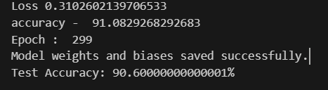

## MNIST-NeuralScratch
### "A neural network built from scratch , without any machine learning libraries to classify MNIST digits using only 'Python' and 'Numpy'.
### This was just a fun project that I made for my in depth understanding of neural networks with deeplearning algorithms and Machine Learning.
#### Since GitHub doesn't allow sharing of large files you can download the DataSet from this link :- 
https://drive.google.com/drive/folders/1EPwKl32m4vDzuaRVzPpaIcR4d74J3pzs?usp=sharing
        
        - Make sure that the train.csv and test.csv files are placed inside the 'src' folder before runnig the model.
## **OverView** 
This project demonstrates the implementation of a neural network model for classifying the MNIST dataset (handwritten digits) using only NumPy. The model is trained from scratch without relying on any pre-built machine learning libraries, providing a great opportunity to understand the underlying mechanics of a neural network, including forward propagation, backpropagation, and weight updates.

## **Working**
- Everything including activation functions, backward propagation and Training loops are implemented from scratch.
- The network has:
  - Input Layer: 784 neurons (for flattened 28x28 pixel images).
  - Hidden Layers: Two fully connected layers with 128 and 64 neurons.
  - Output Layer: 10 neurons (for digit classification 0–9).
## Training The Model :-
### Preprocessing :
- The data is shuffled to ensure randomness.
- The features (image pixel values) are normalized by dividing by 255, converting the range of pixel values from [0, 255] to [0, 1] for a simplified canculation.
### Forward Propagation :
- For each epoch, the data passes through the layers of the network:
   - The input is passed through Layer 1, followed by the ReLU activation.
   - The result is passed through Layer 2, followed by another ReLU activation.
   -Finally, the result is passed through Layer 3, followed by the Softmax activation to obtain predicted probabilities.
### Loss Calculation :
- The Categorical Crossentropy Loss is calculated to measure the difference between predicted values and true labels.
### BackPropagation :
- Gradients are computed for each layer using the chain rule, starting from the output layer and moving backward.
- The weights and biases are updated using the gradients, and the learning rate decays over time.
### Epochs :
- The model can be trained with variable epochs, with a decaying learning rate to improve performance over time.
- The PreTrained Weights are trained on 300 epochs with a 90.6 % of accuracy.

